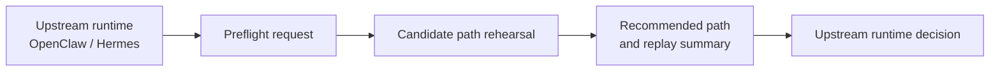

# Agent Preflight

**Rehearse risky browser tasks before your agent commits.**

Agent Preflight is an open-source sidecar for OpenClaw, Hermes, and other agent runtimes.
It helps agents simulate risky browser workflows before real submission, compare candidate paths, and return a safer recommended plan.

**Start here:** [docs/demo-walkthrough.md](docs/demo-walkthrough.md) for the fastest external-developer quickstart.

## Why this exists

Agent runtimes are getting better at planning and acting.

But many high-risk browser tasks still fail in the worst possible way: they explore by touching the real system.

Agent Preflight adds a lightweight pre-execution layer:

- capture a recoverable checkpoint
- explore multiple candidate browser paths
- compare outcomes
- return a recommended path
- optionally hand the approved plan back to the upstream runtime

In short:

> rehearse first, commit later

## What this project is

Agent Preflight is a browser workflow preflight sidecar.

It is designed to sit beside:

- OpenClaw
- Hermes
- custom MCP-compatible runtimes
- browser agents and Playwright-based systems

## What this project is not

- not a full assistant
- not a full agent runtime
- not the full Branching Agent OS product
- not an enterprise-grade control plane

This repository is the public open-source edge of a broader idea: pre-execution control for high-risk agent actions.

## Minimal flow



## First release scope

The first release focuses on:

- browser-first workflows
- risky form submission, admin changes, and config paths
- candidate path rehearsal
- lightweight replay summary
- recommendation output back to the upstream runtime

By default, it does not perform final real-world commit on its own.

## Demo status

### OpenClaw runnable

A minimal runnable OpenClaw demo is included.

From the repository root:

```bash
npm run demo:openclaw
npm run demo:openclaw:stdout
```

What it does:

- reads `examples/openclaw-demo/request.json`
- validates the minimal request shape
- generates a mock preflight recommendation
- writes `examples/openclaw-demo/response.generated.json` unless `--stdout-only` is used

You can also run the script directly:

```bash
node adapters/openclaw/demo/run-demo.js
node adapters/openclaw/demo/run-demo.js --stdout-only
```

Additional scenario:

```bash
npm run demo:openclaw:purchase
```

This uses `examples/openclaw-demo/request.purchase.json` to simulate a purchase flow and writes `examples/openclaw-demo/response.purchase.generated.json`.

### Hermes runnable

A matching Hermes demo runner is also included.

From the repository root:

```bash
npm run demo:hermes
npm run demo:hermes:stdout
```

What it does:

- reads `examples/hermes-demo/request.json`
- validates the minimal request shape
- generates a mock preflight recommendation
- writes `examples/hermes-demo/response.generated.json` unless `--stdout-only` is used

You can also run the script directly:

```bash
node adapters/hermes/demo/run-demo.js
node adapters/hermes/demo/run-demo.js --stdout-only
```

Additional scenario:

```bash
npm run demo:hermes:admin-change
```

This uses `examples/hermes-demo/request.admin-change.json` to simulate an admin change flow and writes `examples/hermes-demo/response.admin-change.generated.json`.

### Expected behavior by risk category

These demos currently use simple mock heuristics rather than a full policy engine.

- `financial_action` is treated as the strongest guardrail case in the current mock logic and may return `needs_review`.
- `purchase` also biases toward safer paths and stronger guardrail notes, even when a demo still returns `ok`.
- `admin_change` is still treated as risky, but can return `ok` when the recommended path stays review-first and guarded.

The point of the examples is to show that different risk categories can shift recommendation tone, path ranking, and review posture before any real commit happens.

### Coverage snapshot

| Runtime | Scenario | Risk category | Expected status posture | Run |
| --- | --- | --- | --- | --- |
| OpenClaw | Default workspace billing update | `admin_change` | `ok`, with review-first recommendation | `npm run demo:openclaw` |
| OpenClaw | Additional team seats purchase | `purchase` | `ok`, but with stronger guardrail notes | `npm run demo:openclaw:purchase` |
| Hermes | Default spending limit update | `financial_action` | `needs_review`, strongest guardrail posture | `npm run demo:hermes` |
| Hermes | Workspace admin contact rotation | `admin_change` | `ok`, if the guarded path remains review-first | `npm run demo:hermes:admin-change` |

This table is meant to show current demo coverage, not a final policy matrix.

### More runtimes coming

The public repository is intentionally runtime-agnostic.
OpenClaw is the first runnable entrypoint, Hermes is now kept at the same runnable demo layer, and more runtime-facing adapters can be added without turning this repo into the full private control plane.

## Repository structure

```text
adapters/
  openclaw/
    demo/
    src/
  hermes/
    demo/
    src/
examples/
  openclaw-demo/
  hermes-demo/
docs/
```

## Adapter status

### OpenClaw

The OpenClaw adapter currently includes:

- minimal request and response types
- a mock decision handler
- sample request and response payloads
- a runnable demo entrypoint
- a second purchase-oriented example payload

### Hermes

The Hermes adapter currently includes:

- minimal request and response types
- a mock decision handler
- sample request and response payloads
- a runnable demo entrypoint
- a second admin-change-oriented example payload

The intent is to keep the public repo runtime-agnostic while still giving developers something concrete to run on day one.

## Integrations

Planned integrations:

- OpenClaw sidecar adapter
- Hermes sidecar adapter
- MCP-compatible API mode
- standalone demo mode

## Repository goals

This repo is built for:

- experimentation
- public demos
- forks and community iteration
- integration examples
- benchmark-style workflow testing

## Status

Early public preview.

## License

MIT
